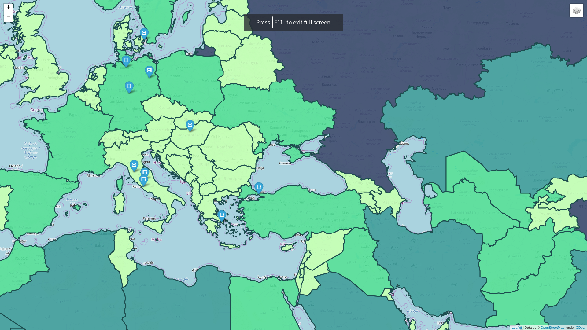
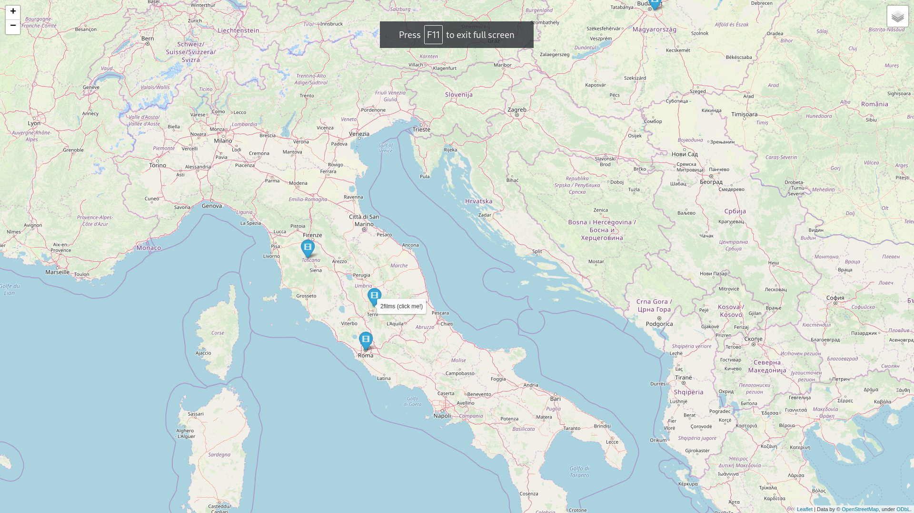
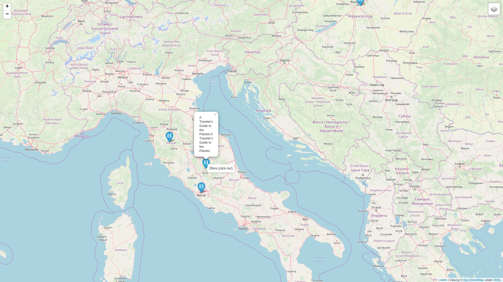

# map
User inputs year they want to know information about, and their coordinates (latitude, longitude). Web map is a result of running program. On the map, here are 10 markers of the neares places where movies were filmed. When user points cursor on the marker, they can see number of movies or episoder filmed on the place, and after clicking, the list of them expands.
The other layer of the map represents world map where countries are colored based on their area.

## Installation
Use the package manager [pip](https://pip.pypa.io/en/stable/) to install following libraries

``` 
pip install folium
```
``` 
pip install geopy
```
``` 
pip install pandas
```

## Structure of HTML file
File consists of three parts (head, body, script).
Also CSS and JavaScript are used and connected with HTML file appropriately.

## Example of running the program
```
Type year you want to get information for: 2010
Type your latitude: 49.842957
Type your longitude: 24.031111
processing, please wait...
Done! Please, check test.html
```




## Conclusion
The map includes information about areas of the countries and places where movies were filmed based on given location and year.
